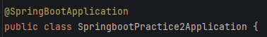
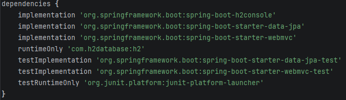
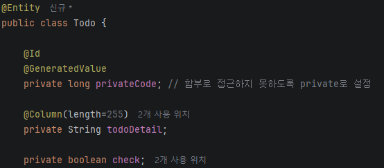
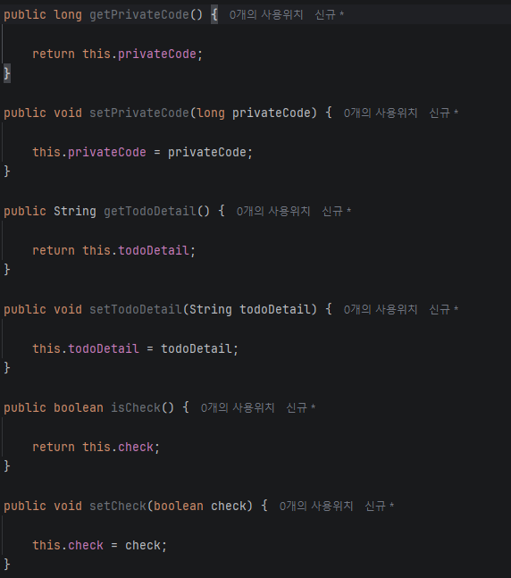

# Spring boot study

## Spring boot란?

Spring Framework는 자바 기반의 애플리케이션을 만들기 위한 프레임워크이다. 강력하지만 초기 설정(XML 설정, 라이브러리 버전 관리, 서버 배포 설정 등)이 매우 복잡하다는 단점이 있었음. 그리고 이 단점을 해결하기 위해 나온 도구가 Spring boot.

요약: Spring Framework의 귀찮은 초기 설정을 대신 해줄 초간단 도구

## Spring boot의 특징

### 자동 설정
개발자가 어떤 라이브러리를 추가했는지 감지하여 Spring이 필요로 하는 설정을 자동으로 구성해줌
### 내장 서버
별도 웹 서버를 설치하고 배포할 필요 없이 애플리케이션 자체에 서버가 내장되어 실행만 하면 바로 웹 서비스가 됨
### 의존성 관리 최소화
spring-boot-starter-web처럼 필요한 기능 단위로 묶인 패키지를 추가하면, 관련된 여러 라이버리를 일일이 버전에 맞춰 넣을 필요가 없음

## IoC 컨테이너와 Bean의 개념

### IoC(Inversion of Control, 제어의 역전)
일반적인 자바 프로그래밍의 경우 개발자가 직접 new 키워드를 통해 객체를 생성하고 객체가 필요한 다른 객체에 직접 생성하여 넣음. 즉 객체 생성과 관리의 제어권이 개발자에게 있음

그럼 IoC는 어떤 역할을 하나, 바로 **IoC는 제어권을 Spring 컨테이너에게 넘김**. 개발자는 객체가 필요하다는 표시를 하면 **Spring이 알아서 객체를 생성하고 필요한 곳에 연결**까지 하여 **생성 부터 소멸까지 알아서 관리**해주는 매우 편리한 기능을 제공함

그리고 이 기능을 관리해 주는 것이 바로 IoC 컨테이너, 애플리케이션(웹)이 시작될 때, Spring은 이 컨테이너를 만들고 객체를 채우기 시작함

### Bean
(IoC와 연결된 내용) 이 때, 컨테이너 내부에서 Spring이 생성하고 관리하는 객체를 Bean이라고 부름. 그리고 어떠한 클래스를 Bean으로 등록하라고 표시하는 방법이 어노테이션(아래에 서술)

### Bean으로 등록시키는 어노테이션
아래 서술한 @ComponenetScan(8번)은 Bean으로 등록해야 할 클래스를 찾음. 이번에는 Spring이 어떤 클래스를 Bean으로 등록해야 하는지 특정하는 어노테이션을 서술함

* @Component: 가장 기본적인 표시이며 "이 클래스는 Spring이 관리하는 Bean이다"라는 뜻

* @Service: 비즈니스 로직(핵심 처리 로직)을 담당하는 클래스에 붙임. 기능적으로는 @Component와 동일하게 동작하지만, "이 클래스의 역할은 서비스의 계층임"라는 의미를 코드만 보고 알 수 있게 해줌

* @Repository: 데이터베이스 접근을 담당하는 클래스에 붙임. 마찬가지로 @Component의 역할을 하며, 추가로 데이터베이스 관련 예외를 Spring이 이해하는 형태로 변환해주는 기능을 포함함

* @Controller: 웹 요청을 받는 클래스에 사용됨

즉, 네 가지 어노테이션 모두 하위 클래스를 Bean으로 등록하라는 같은 기능을 하지만, 각자가 어떤 역할을 맡고 있는지를 이름만으로 구분해주는 것임, 이렇게 역할별로 나누는 이유는, 코드를 읽는 사람이 클래스의 역할을 **한눈에 파악할 수 있게 하기 위함**이며, 이는 대분류 4의 계층형 아키텍처와 직결됨 

### 의존성 주입(DI, Dependency Injection)
DI는 IoC의 구체적인 실현 방법 중 하나

어떤 클래스(A)가 동작하기 위해 다른 클래스(B)의 기능이 필요할 때, "A가 B에 의존한다"고 표현함. 이 때 B 객체를 A가 직접 생성하는 것이 아니라, **외부(Spring 컨테이너)에서 만들어서 A에게 넣어주는 것**을 의존성 주입이라고 함

의존성을 주입하는 방법 3가지
1. 생성자 주입: 클래스의 생성자를 통해 필요한 객체를 전달받는 방식, Spring 공식 문서와 실무에서 가장 권장받는 방식.
    - 객체가 생성되는 시점에 필요한 의존성이 모두 갖춰짐이 보장됨(즉, 필요한 것이 없으면 애초에 객체 생성 자체가 안 됨)
    - 필드를 final로 선언할 수 있어, 한 번 주입된 이후 변경되지 않음이 보장됨
    - 테스트 코드 작성 시 객체를 직접 생성하기 용이함.
2. 필드 주입: 클래스의 필드(맴버 변수에) @Autowired를 직접 붙여서 주입받는 방식. 코드가 짧아보이지만, 객체가 불완전한 상태로 생성될 수 있고 테스트가 어려워 최근에는 권장되지 않음
3. Setter 주입: Setter 메서드를 통해 주입받는 방식. 선택적인 의존성이 있을 때 사용되지만, 자주 쓰이지는 않음

### @Autowired란?
이 자리에 필요한 Bean을 Spring 컨테이너에서 찾아서 자동으로 연결하라는 표시

동작 원리
1. Spring 컨테이너 안에 여러 Bean들이 등록되어 있음
2. 어떤 클래스가 다른 Bean을 필요로 할 때, @Autowired가 붙은 지접(생성자, 필드, Setter)에 타입을 기준으로 컨테이너 안에서 일치하는 Bean을 찾아 연결해줌

## MVC 패턴 개념
MVC는 애플리케이션을 세 가지 역할로 나누는 설계 패턴

* Model: 데이터베이스와 비즈니스 로직을 담당
* View: 사용자에게 보여지는 화면
* Controller: 사용자의 요청을 받아서, 어떤 Model을 사용할지 정하고, 처리 결과를 어떤 View로 보여줄지 연결하는 역할

즉, Controller는 요청을 받는 입구이며, 어떤 Model을 사용하고 어떻게 View로 보여주어야 할 지 전달하는 총괄을 맡음

*주의*  
Spring에서는 Controller가 요청을 받으면, 실제 처리는 Service에게 위임하고, 처리된 결과를 어떻게 응답할지를 결정하는 역할을 함

### @Controller vs @RestController
Controller 클래스에 붙이는 어노테이션은 두 가지가 있으며, 응답 방식이 근본적으로 다름

* @Controller: 메서드가 반환하는 문자열을 "View의 이름(파일명)"으로 해석함. 즉, 해당 이름을 가진 HTML 파일을 찾아 사용자에게 화면을 보여줌. 전통적인 화면(페이지) 기반 웹 개발에 사용
* @RestController: 메서드가 반환하는 값을 View의 이름이 아닌 **순수 데이터**로 취급하여 그대로 응답 본문에 담아 전달. 주로 문자열이나 Json의 형태의 데이터로 반환하며, 자주 쓰이는 어노테이션임(어노테이션 정리 2번에 자세히 서술됨)

요약: Controller는 직관적인 화면 출력, RestController는 데이터 전송

### @RequestMapping, @GetMapping, @PostMapping 등
Controller클래스 안의 메서드가 어떤 주소(URL), 어떤 방식(HTTP Method)의 요청이 왔을 때 실행될 지를 정하는 어노테이션들

HTTP 요청의 대표적인 방식(Method)
* GET: 데이터 조회
* POST: 데이터 생성
* PUT: 데이터 수정
* DELETE: 데이터 삭제

이를 지정하는 방법들
* @RequestMapping: 가장 기본적인 형태로 URL, Method를 함께 지정 가능함
* @Get, Post, Put, Delete(중 하나)Mapping: @RequestMapping에서 Method를 미리 고정해둔 축약형. Get요청을 받고 싶다면 Get을, Put요청을 받고싶다면 Put을 쓰는 아~주 직관적이고 마음에 드는 실무에서 가장 많이 사용되는 방식

*한 번 보기*  
클레스 레벨에 @RequestMapping("/api") 처럼 붙여질 수 있는데, 이 경우 그 클래스 안의 모든 메서드 URL 앞에 /api가 공통적으로 붙게 됩니다.

### @RequestParam, @PathVariable, @RequestBody
사용자가 보낸 요청에는 많은 형태로 데이터가 담겨옴. Controller메서드는 그 데이터를 파라미터로 받아야 함, 허나 데이터가 어떤 형태로 왔는지에 따라 받는 방법이 다름

* @RequestParam: URL 뒤에 ?key = value 형태로 붙는 쿼리 파라미터를받을 때 사용.
    ex) /search?keyword=spring 에서 keyword를 받고 싶을 때
* @PathVariable: URL 경로 자체에 값이 포함되어있을 때 사용.
    ex) /users/3에서 3 이라는 값(사용자 ID)을 URL경로의 일부로 받고 싶을 때. URL 매핑 시 {}로 자리표시를 해둠(예: /user/{id})
* @RequestBody: 요청의 본문(body)에서 JSON 형태로 담겨 온 데이터를 받을 때 사용됨. 주로 POST, PUT 처럼 새로운 데이터를 생성 및 수정 할 때, 클라이언트가 JSON 형태의 객체 데이터를 보내면 이를 JAVA 객체로 변환해서 받음.

*세 가지 방법의 차이점 요약*  
데이터가 어디(쿼리스트링/URL경로/본문)에 담겨왔는지에 따라 받는 방법이 달라짐

### ResponseEntity
ResponseEntity는 응답을 좀 더 세밀하게 제어하고 싶을 때 사용되는 객체

단순히 데이터만 반환하면, Spring이 자동으로 HTTP 상태 코드(예: 200OK)를 붙여서 응답함. 하지만 실제 서비스에서는 상황에 따라 드른 상태 코드를 명시적으로 응답해야 할 때가 많음(예: 데이터를 찾지 못하면 404, 새로 생성했으면 201 등)

ResponseEntity를 사용한다면
* 응다 본문에 어떤 데이터를 담을지
* HTTP 상태 코드를 무엇으로 할지
* 필요하다면 응답 헤더까지

이 세 가지를 개발자가 직접 조합하여 응답을 구상할 수 있음. 즉, "이 요청은 정상 처리되었으니 200과 함께 데이터를 줍니다." 혹은 "이 데이터는 없으니 404만 응답합니다."와 같은 **상황별 다른 응답을 만들 수 있게 해주는 도구**

## 서비스/데이터 계층

### 계층형 아키텍쳐의 필요성
지금 배운 Controller는 요청을 받는 입구의 역할을 함. 그런데 만약 이 안에서 DB조회, 비즈니스 규칙 검증, 응답 데이터 가공 등 전부 처리하려고 하면 상당히 복잡하고 머리가 아플 것임

* 코드가 한 곳에 이리저리 뒤섞여 전달력이 부족해지고 역할을 확인하기 어려움
* 위치를 찾거나 역할을 찾기 어려워지니 같은 로직을 다른 곳에서 활용하기 어려워짐
* 테스트하기가 어려워짐

그리하여 있는 것이 Spring의 역할 분담 3계층

* Controller: 요청을 받고 응답을 돌려주는 역할(입구/출구)
* Service: 실제 비즈니스 로직(규칙, 계산, 처리, 흐름 등)을 담당
* Repository: 데이터베이스에 직접 접근하여 데이터를 저장 및 조회하는 역할

흐름
```
사용자 요청 -> Controller -> Service -> Repository -> DB
                                ▽
사용자 응답 <- Controller <- Service <- Repository <- DB
```

정리  
Controller가 Service를 부름, 이후 Service가 Repository를 부름, Repository가 DB를 조회함
위와 같이 딱딱 나누어 자신의 역할에 집중함 이것이 바로 DI가 실전에서 쓰이는 방식

### Service의 역할과 어노테이션
Service는 비즈니스 로직을 담당한다. 구체적으로는 아래 서술
* Controller로부터 전달받은 데이터를 가공하거나 검증
* 여러 Repository를 조합하여 하나의 비즈니스를 완성(동시 실행 작업을 정돈 한다는 뜻)
* 실제 "업무 규칙"을 코드로 구현(예: DB의 domain 범위 조절 등)

*중요 개념 잡기*  
트랜잭션(Transaction): 여러 작업을 하나의 단위로 묶어 전부 성공, 혹은 전부 실패하게 만드는 것

*실무 예시로 감 잡기*  
사용자의 주문에 의해 재고의 개수가 떨어지며 주문이 올라야 함. 이 때 재고의 개수는 떨어졌지만 주문이 올라가지 않는다면 데이터가 불일치하게 됨. 그리하여 Service메서드에는 @Transaction 어노테이션을 사용하여 모든 작업이 성공, 혹은 실패로 남게 하여 만일 하나라도 실패하게 될 경우 전부 실패하도록 합니다.  
(하나라도 실패하면 원래 상태로 복구(rollback)합니다.)

### JPA와 Entity의 개념
JPA(Java Persistence API): 자바 객체와 데이터와 DB의 테이블을 서로 연결(매핑) 해주는 표준 기술

원래라면 DB를 다루기 위해 SQL 쿼리를 작성해야 함으로 상당히 귀찮지만, JPA는 다르다. **자바의 객체(클래스)를 데이터베이스와 매핑시키고 객체를 다루는 것 만으로도 데이터베이스 작업이 가능**하도록 해주는 엄청나게 편한 기술이다.  

이 때 DB의 테이블과 매핑되는 자바의 클래스를 Entity라고 한다.

Entity 클래스 생성 대표 어노테이션
* @Entity: 이 클래스가 DB의 테이블과 매핑되는 Entity임을 선언
* @Id: 이 필드는 테이블의 기본 키(Primary key)임을 알림
* @GeneratedValue: 기본 키 값을 데이터베이스가 자동으로 생성하도록 설정(SQL의 'auto_increment'였나 그거)
* @Column: 특정 필드를 테이블과의 컬럼과 매핑할 때, 컬럼명이나 제약조건을 세부적으로 지정(not null, unique 등, 생략한다면 일반 컬럼이 됨)

*정리*  
**Entity 클래스 하나 당 테이블 하나이고 클래스의 필드 하나하나가 테이블의 컬럼과 대응**한다고 생각하면 편하다.

### Repository 인터페이스(JpaRepository)
Repository의 역할은 DB에 직접 접근 하는 계층 여기서 또 개편한 방식이 하나 있는데 그것이 바로 Spring data JPA를 이용하는 것.  
어떻게 편해지느냐 하면, DB에 접근하는 코드를 직접 작성하지 않아도 된다는 점

방법은 바로 **JpaRepository라는 인터페이스를 상속**받는 것.  
이 인터페이스는 두 가지 정보 타입을 요구함
1. 어떤 Entity를 다룰 것인가
2. 그 Entity의 기본 키 즉 @Id의 타입이 무엇인가

이리하여 상속을 받게 된다면, Spring이 알아서 기본적인 DB작업 메서드를 생성해줌
* 저장하기(save)
* ID로 조회하기(findById)
* 전체 조회하기(findAll)
* 삭제하기(deleteById)

개발자는 인터페이스 선언만 하면 되고, 실제 구현은 Spring data JPA가 내부적으로 해결해주니 이보다 맛도리일 수가 없다. 이는 @Repository가 왜 별도로 필요 없어지는지와도 연결됨  
JpaRepository를 상속 받은 인터페이스는 Spring이 자동으로 Bean으로 인식해 등록해주기 때문이다.

## 데이터베이스와 연동

### 데이터소스 설정
Entity나 Repository 등은 동작하기 위해 어떤 DB에 어떻게 접속하게 할 지 설정해주어야 함. 이 접속 정보를 담는 것을 데이터소스(DataSorce)라고 함.  
주로 쓰이는 데이터베이스는
* H2: 자바에서 만들어진 아주 가벼운 데이터베이스, 별도의 설치 없이 실행될 때 자동적으로 메모리(혹은 파일) 위에 즉석에서 생성되고 종료하게 되면 함께 사라지며 기능이 잘 되는지 확인하는 빠른 테스트할 때 쓰기에 용이함
* MySQL: 실무에서 널리 쓰이는 데이베이스로, 별도의 다운로드가 필요하며 별도의 서버를 띄우고 이에 접속하는 방식을 사용해야 함, 데이터가 영구적으로 저장됨

이에 대한 접속 정보는 application.properties(아마도 IoC부분과 관련 있는 듯)에 작성해야 함.  
설정 항목
* spring.datasource.url: 접속할 데이터베이스와 구조
* spring.datasource.username: 접속 계정
* spring.datasource.password: 접속 비밀번호
* spring.datasource.driver-class-name: 어떤 종류의 데이터베이스에 접속하는지 알려주는 드라이버 정보

### Hibernate의 동작 원리
위에 쓴 것 처럼 JPA는 java의 클래스와 DB를 매핑해주는 표준 같은 것 정도를 배웠는데 그럼 또 생각해 볼 것이 "그럼 이걸 누가 실행해?"를 생각 해 볼 수 있는데, 그러기 위해서 필요한게 구현체.  
JPA는 "너(Java 클래스)랑 너(DB 테이블), 둘이 짝꿍해"라고 시키는 명령이라면 구현체는 이제 그걸 진짜로 시키는 행동이라 생각할 수 있음

그런 구현체들 중 널리 사용되는 것이 "Hibernate". Spring boot에서 JPA 관련 스터디(spring-boot-starter-data-jpa)를 추가하면, 내부적으로 Hibernate가 기본 구현체로 딸려들어옴

Java의 클래스에 @Entity를 붙이고 save()를 호출하면 이 구현체(Hivernate)가 알아서 SQL의 필드값을 분석해서 create table ~이건 insert into ~와 같은 SQL을 생성하여 데이터베이스에 실행해주는 것. 이래서 SQL을 몰라도 개발자는 데이터베이스 관련 개발을 조금이나마 할 수 있느 것.

### ddl-auto
써있지는 않지만 DDL이 아마 SQL의 DDL(정의어), DML(조작어), DCL(제어어)의 DDL이라 감히 생각함  
Entity 클래스를 만든다고 자동으로 DB에 테이블이 생기고 뭣이고 하는게 아님. 그게 되면 그건 마법이지 코딩이 아님, 즉 이 Entity를 어떻게 조리해서 테이블로 만들지 어떻게 처리할지를 설정하는 것이 "spring.jpa.hibernate.ddl-auto".

옵션값으로는
* create: 실행 때 마다 이전에 생성되었던 테이블을 싹 밀어버리고 Entity를 기준으로 새로 만듦(기존 데이터 삭제)
* update: 기존 데이터를 유지하며, Entity에 변경된 내용(새로운 필드든, 필드의 삭제든)을 반영하여 수정함
* validate: 테이블을 생성 및 수정 하지 않고, Entity와 실제 테이블의 구조가 일치하는 확인함(일치하지 않으면 오류)
* none: 아무것도 안함(왜 있는거임?)

학습 단계에서는 create와 update를 사용해 Entity를 만들면 자동으로 테이블에 생기는 것을 확인하는 것이 일반적이며 실무에는 데이터의 손실의 위험성 때문에 validate나 none을 사용함

## 예외 처리와 검증

### @Valid를 이용한 입력 검증
사용자가 API로 데이터를 보낼 때(회원가입의 이메일 등), 항상 그에 옳은 데이터를 보낸다는 보장이 없음.  
그래서 이 잘못된 데이터가 입력되었을 때 Service나 Repository로 넘어가기 전에 Controller 단계에서 미리 걸러내는 작업이 중요함

Spring에서는 이를 위해 두 가지 요소를 함께 사용함

1. Entity(혹은 DTO) 클래스의 필드에 검증된 규칙을 어노테이션으로 선언
    * @NotNull: 값이 null이면 안됨
    * @NotBlank: 문자열이 null이거나 빈 문자열(""), 공백만 있으면 안됨
    * @Size(min= , max= ): 문자열 길이나 리스트의 크기의 범위를 제한
    * @Email: 이메일 형식이여야 함
    * @Min, @Max: 숫자의 최솟값 및 최댓값 제한
2. Controller메서드의 파라미터 앞에 @Valid 붙이기  
@RequestBody로 밭을 때 앞에 @Valid를 붙이면, Spring이 그 객체를 Service로 넘기기 전에 먼저 각 필드에 선언된 검증 규칙을 전부 확인함. 만약 하나라도 규칙을 어기면 Service 코드가 실행되기도 전에 자동으로 예외가 발생하고 요청이 거부됨  
흐름  
```
요청 도착 -> @Valid가 필드별 규칙 검사 -> 통과하면 Service로 전달 -> 위반 시 즉시 예외 발생(Service 실행 안됨)
```

이렇게 한다면 매 순간마다 데이터가 올바르게 작성되었는지 확인하는 로직을 항상 구현 할 필요 없음

### @ExceptionHandler/@ControllerAdvice

그런데 말입니다? 만약에 @Valid에서 검증을 실패하거나, Service/Repository 단에서 예외가 발생하면 어떻게 될까??  
아무런 처리도 하지 않으면, Spring이 기본적으로 매우 불친절한 형태의 오류 응답을 사용자에게 고스란히 보여줍니다!  
이 상황은 보안적 문제로도 사용자의 입장에서도 매우 꼴사나운 모습이죠.  
그래서 그래서 이 문제가 발생하였을 때 우리의 언어로 보기 좋게 변환하여 보여주는 장치가 필요 함

* @ExeptionHandler: 특정 예외 타입이 발생하였을 때 실행될 메서드를 지정하는 어노테이션. 예시 상황으로는 "회원을 찾을 수 없음" 예외가 발생하면 이 어노테이션이 붙은 메서드가 붙잡아서, 404와 가은 상태 코드와 함께 "회원을 찾을 수 없습니다"라는 메시지를 담은 ResponseEntity로 변환하여 응답할 수 있음
* @ControllerAdvice: 개별 Controller클래스마다 예외 처리 코드를 반복해서 넣은 대신, 애플리케이션 전체에서 발생하는 예외를 한 곳으로 공통으로 처리할 수 있게 해주는 어노테이션. 이 어노테이션이 붙은 클래스 안에 @ExeptionHandler가 붙은 메서드들을 모아두면, 어떤 Controller에서 예외가 발생하든 이 클래스가 가져와서 해결함

**정리**  
@ExeptionHandler: 예외 발생 시 어떻게 처리할 지 알려주는 개별 규칙  
@ControllerAdvice: 그 규칙들이 애플리케이션 전역에서 공통으로 적용되게 모아두는 컨테이너

## 빌드와 실행

### 내장 톰캣의 개념
Spring boot의 특징인 '내장 서버'의 구체화

원래의 Java 애플리케이션은 모두 웹 서버(WAS, Web Application Server) 위에서 작동함. 대표적인 것으로는 톰캣(Tomcat)이 있음. 전통적인 방식으로는 개발자가 톰캣을 따로 설치하고, 자신이 만든 애플리케이션을 톰캣 위에 배포 하는 형식의 길고 지루한 과정이 필요했음.

하지만, 우리의 Spring Boot는 이 과정을 확 뒤엎어버림. spring-boot-starter-web을 의존성에 추가하면, 톰캣 자체가 라이브러리 형태로 프로젝트 안에 포함되게 됨. 즉 별도의 다운 없이 애플리케이션을 시작하는 순간 내부 톰캣이 켜지며 곧바로 웹 서버의 역할을 하는 초 간편 시스템

This 내장 톰캣 이라고 함. 그냥 main 메서드를 시작하는 것 만드로도 서버가 딸깍으로 켜지는 이유가 바로 이것 덕분임. 이 때 열리는 포트가 server.port 설정값(기본값 8080)

### jar 빌드와 실행
지금까지 해온 방법들은 컴퓨터 내부에서 실행하는 것 뿐임. 하지만 실제 다른 컴퓨터(서버)에 배포하기 위해서는 이 프로젝트를 하나의 실행 가능한 파일로 묶어야 함

그럼 나오는게 무엇이냐? 하면 바로 위에서 배웠던 Gradle. 저 도구의 빌드 기능을 사용하면, 작성한 모든 자바 코드, 라이브러리, 설정 파일이 실행 가능한 '.jar'파일로 압축됨

요로코롬 만들어진 jar 파일의 특징
* 내장 톰캣도 함께 압축이 되어 이 jar 파일 하나만 있어도 어디서든 서버를 열 수 있음.
* java -jar 파일이름.jar의 명령어의 형태로 실행함
* 이 jar 파일을 실제 운영 서버에 옮겨서 실행하면 그게 바로 배포임.

**흐름**  
```
소스 코드 작성 -> Grable로 빌드(jar 생성) -> 서버로 jar 전달 ->  java -jar 로 실행 -> 서비스 시작
```

### 프로파일(Profile)의 개념
이게 개발을 하다 보면 테스트도 해봐야 하고, 배포도 해야 하는데. 배포해서 실사용 되는 환경이랑, 테스트 하는 환경이 다를 수 있기 때문에 이 프로파일이 필요함

대표적인 환경으로는
* 개발자의 컴퓨터에서 테스트 할 때
* 실제 사용자에게 서비스할 때

'그럼 테스트가 끝나고 배포할 때 코드를 수정해야 하나요?'라는 생각이 드는데, 이거이거 그럴꺼면 때려칩니다. 바로바로 이 프로파일을 이용하는 것인데
* application-dev.properties, application-prod.properties처럼 환경별로 별도의 설정 파일을 만들어둠
* 애플리케이션 실행 시 spring.profiles.active=dev 처럼 어떤 프로파일을 이용할지 지정하면 환경에 맞는 설정 파일이 적용됨
* 기본 application.properties에는 모든 환경에서 공통으로 쓰이는 설정을, 각 프로파일 파일에는 환경별로 다른 설정만 작성하는 방식이 일반적임  
이렇게 나누니 배포할 때나 테스트 할 때나 등등 코드를 바꾸지 않고 설정값을 지정해 줌으로써 편리하고 유연하게 바꿀 수 있음

## 어노테이션 정리
* 필수적인 것 부터 천천히 추가할 것
1. @SpringbootApplication
    - 위치: 프로젝트를 처음 켤 때 실행하는 메인 클래스(ex ~Application.java)의 위
    - 역할: 프로젝트의 시작점을 알리는 총괄 어노테이션
    - 특징: 내부에 컴포넌트 스캔 기능을 포함하고 있어 앱이 켜질 때 주위를 훑어 하위 클래스 및 패키지를 실행할 수 있게 하고 @RestController 등의 어노테이션을 찾아 등록시키는 역할을 함, @Configuration, @EnableAutoConfiguration, @ComponentScan이 합쳐진 형태
2. @RestController
    - 위치: 웹 요청을 받아 처리하는 클래스의 위
    - 역할: 응답을 받은 데이터를 순수 데이터(JSON, 텍스트 등)으로 전달하는 공간임을 선언함
    - 특징: @Controller와 @ResponseBody가 합쳐진 형태이며, 데이터를 다루는 컨트롤러를 만들 때 기본으로 붙임
3. @GetMapping
    - 위치: 컨트롤러 내부의 개별 메서드 위
    - 역할: 누군가 특정 주소(/주소)로 조회 요청을 보내면 그에 걸맞는 주소를 가진 어노테이션이 아래 있는 메서드를 실행하도록 하는 표지판의 역할을 함
    - 특징: 브라우저 주소창에 치고 들어오는 모든 조회 요청을 받아내는 기본적인 문고리 역할을 함
4. @Autowired
    - 위치: 필드, 생성자, 혹은 수정자 위(변수나 메서드 앞)
    - 역할: 클래스 내부에서 필요한 다른 부품(Service, Repository 등)을 조리하여 가져오게 함
    - 특징: 개발자가 직접 new 키워드로 객체를 만들지 않아도, 스프링이 미리 만들어둔 부품을 알아서 연결해줌
5. @PathVariable
    - 위치: 메서드의 파라미터 앞
    - 역할: 사용자가 주소의 빈칸 자리에 실제로 무언가 적어 보냈을 때 스프링에게 주소 빈 칸에 들어온 값을 받아 자바 변수에 집어넣으라 지시하는 명령어
    - 특징: ..
6. @Configuration
    - 위치: @SpringbootApplication으로 인해 잘 사용되지 않음
    - 역할: 이 클래스가 설정 정보를 담는 클래스임을 알림
    - 특징: ..
7. @EnableAutoConfiuration
    - 위치: @SpringbootApplication으로 인해 잘 사용되지 않음
    - 역할: 자동 기능을 활성화 함
    - 특징: ..
8. @ComponentScan
    - 위치: @SpringbootApplication으로 인해 잘 사용되지 않음
    - 역할: 이 클래스가 위치한 패키지의 하위의 모든 클래스를 스캔해서, Spring이 관리해야 할 객체(Bean)들을 찾아냄
    - 특징: ..
9. @Entity
    - 위치: DB와 매핑될 클래스의 위
    - 역할: 이 클래스가 DB와 매핑됨을 알림
    - 특징: 내 마음에 쏙 듦
10. @Id
    - 위치: DB와 연결된 클래스의 기본 키로 설정 될 필드를 지정
    - 역할: 기본 키(Primary key) 지정
    - 특징: ..
11. @Column
    - 위치: DB와 연결된 클래스의 컬럼을 설정하는 부분(사실 잘 모름, 수정 필요)
    - 역할: 컬럼 설정. 이게 없으면 기본 세팅됨(아무 제약 조건 없음)
    - 특징: 이름이 아주 직관적임
12. @GeneratedValue
    - 위치: 자동으로 생성되었으면 하는 기본 키의 위
    - 역할: 기본 키를 중복되지 않도록 자동으로 만들어줌
    - 특징: SQL의 auto_incerment과 아주 유사함
13. @Transactional
    - 위치: Service랑 관계 있는데 사실 잘 모름(수정 필요)
    - 역할: 트랜잭션, 연계되는 작업을 하나의 작업 단위로 만들어 모두 실패 혹은 모두 성공하도록 함
    - 특징: 이름이 아주 직관적임
14. @Valid
    - 위치: ..
    - 역할: 예외 캐치
    - 특징: ..
15. @ExeptionHandler
    - 위치: 메서드 위(정확하게 모름)
    - 역할: 예외 발생 시 어떻게 처리할 지 알려주는 개별 규칙
    - 특징: ..
16. @ControllerAdvice
    - 위치: 클래스의 위(정확하게 모름)
    - 역할: 규칙들이 애플리케이션 전역에서 공통으로 적용되게 모아두는 컨테이너
    - 특징: ..

## 기억나는 것들만 쏙쏙 쓰기(생각 날 때마다 쓰기)

### 1차 2026.08.15
Spring boot는 Spring Framework를 사용하기 편하게 만든 도구이다.  
어노테이션으로 클래스 혹은 필드를 지정(영역 선언) 하여 용도와 역할을 깔끔하게 분리하며 어노테이션들마다의 기능이 따로따로이다.  
JPA, 지금까지 배운 것들 중 가장 마음에 드는 것이다. DB와 연결하기 위해 하나하나 로직을 구현하는 것이 아닌 어노테이션으로 DB와 연결하여 편리한 기능을 활용할 수 있다. @Id는 테이블의 기본 키를 지정하는 것이고, @Column은 이름처럼 컬럼을 지정하는 것이다. @Column이 없다면 아무 제약이 없는 기본필드가 생성된다. @Transaction, 이건 프로그래밍기능사 연습할 때 봤던 기억이 있어서 생각보다 쉽게 외웠음. 여러개의 연계되는 작업을 하나의 작업단위로 맞추어 내부의 작업이 모두 실패, 혹은 성공 하도록 한다. 만일 하나의 작업이라도 실패하게 된다면 모든 작업을 실패한 것으로 복구한다. 이는 Rollback의 개념과 같다.  
너무 늦게 나온 감이 있지만 IoC, Bean, 그리고 뭐가 있던 것 같은데 다시 읽어봐야겠다. 사실 뭔지도 잘 기억 안 난다.  
그리고 아까 설명한 JPA에 대하여 추가로 기억난 것이있다. @Entity인데 이것의 위치는 Java의 클래스를 DB의 클래스와 매핑? 하는 것이다. 하나의 @Entity당 하나의 테이블이다.  
그리고 순수 데이터 전송 공간을 선언하는 어노테이션이 있었는데 아마도 @RestController였던 것으로 기억난다. 이건 @Responsabody? 이것과 @Controller가 합쳐진 것이고 @Controller와 비교하였을 때 @Controller는 사용자로 하여금 데이터를 받았을 떄 그것을 이름 자체로 기억을 하여 그에 맞는 HTML과 연결한다는 식으로 기억을 하고 있고 @RestController는 전달 받은 데이터를 순수한 데이터(텍스트나 JSON)로 받아들여 다른 하위 어노테이션이 받도록 영역을 선언하는 느낌이었던 것 같다.
#### 틀린 부분 다시 집기
(순서는 아주 뒤죽박죽)
1. @Transactiona이 아닌 @Transactional이다.
2. 258번 줄 'DB의 클래스와 매핑?'이 아닌 'DB의 테이블과 매핑'이다. 좀 멍청한 실수....
3. @RestController 부분 '@Responsabody?'가 아닌 '@ResponseBody' 영어 실력이 문제인 듯 하다
4. 가장 큰 문제 IoC, Bean 부분 추가 설명
    * IoC(Inversion of Control, 제어의 역전): 일반적인 Java는 new 치고 뭐 하고 힘들게 객체를 생성하여 개발자가 제어권을 갖지만 IoC는 제어권을 Spring에게 넘겨 개발자가 객체가 필요하다는 표시를 하면 Spring이 알아서 객체를 생성하고 필요한 곳 까지 연결함, 즉 생성부터 소멸까지 알아서 관리해줌
    * Bean: 컨테이너 내부 Spring이 생성&관리 하는 객체. 이놈이 어떤 클래스를 어떤 Bean으로 등록할 지 표시하는 어노테이션이 존재함(Bean으로 등록시키는 어노테이션 부분 30번 줄)


## 실습 단계
  
@SpringBootApplication의 위치  
'프로젝트이름Application.java' 파일에 위치함(프로젝트 이름에 '-'이 들어갔지만 지워진 형태로 써져있음)  

이론 때 썼던 spring-boot-starter-web은 업데이트를 통해 spring-boot-starter-webmvc로 이름이 바뀜

---

  
Spring boot를 생성할 때 추가한 의존성들

---
  
클래스 위에 @Entity 어노테이션을 달아 이 클래스가 DB의 테이블임을 알림

@Id, @GeneratedValue, @Column등의 어노테이션을 사용해봄(각각의 역할은 위에 정리)  
빈 생성자는 Spring/JPA(JSON 변환 라이브러리) 같은 프레임워크가 리플렉션을 통해 객체를 동적으로 생성 할 때 필요로 함

  
안정적으로 값을 받기 위해 Getter/Setter를 사용함